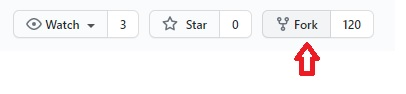
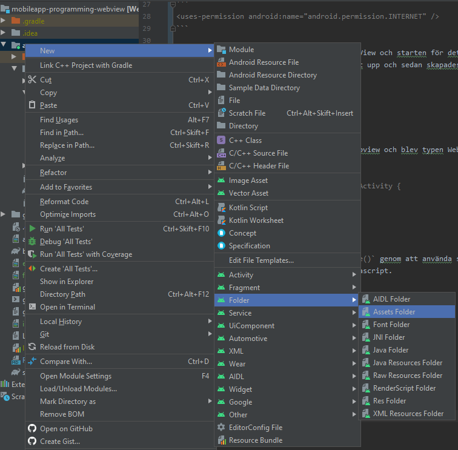
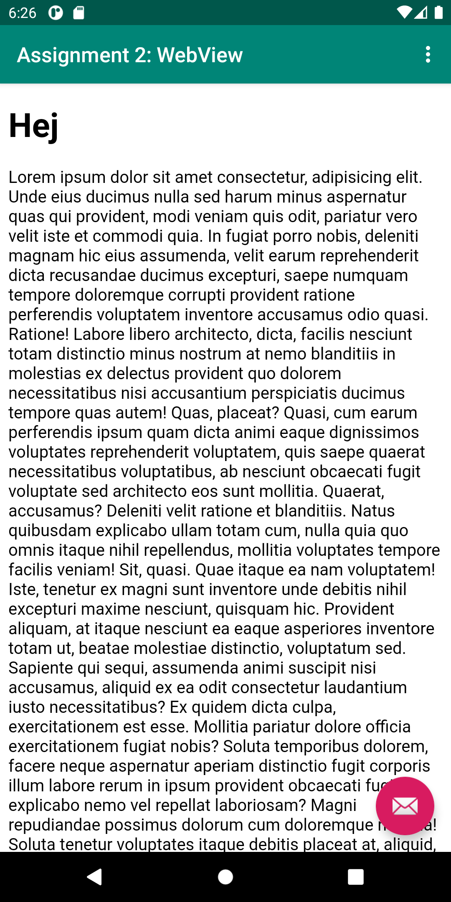

# Rapport Assignment 2: WebView a16petha

Denna uppgift består av flera olika delmoment som skall gås igenom. Först ut är att en app skall "forkas" via Githbub vilket innebär att
användaren får sin egna version av applikationen och i figur1 nedan syns det hur knappen ser ut. 


Figur1

Nästa del var att döpa om appen och detta görs genom att går till katalogen `res/values/strings.xml` och ändra värdet i app_name som detta fall
ändrades till Assignment 2: WebView som syns i koden nedan. I figur2 högst upp syns appnamnet 

```
<resources>
    <string name="app_name">Assignment 2: WebView</string>
    <string name="action_external_web">External Web Page</string>
    <string name="action_internal_web">Internal Web Page</string>
</resources>
```


Figur2

För att applikationen skall få tillgång till internet är det tvunget att lägga till en liten kodsnutt i filen `AndroidManifest.xml`
som syns i koden nedan och det är allt som krävs.

```
<uses-permission android:name="android.permission.INTERNET" />
```

Härnäst var det dags att ändra skapa en WebView och starten för detta var att ändra texten i `content_main.xml` och ändra den TextView som 
redan fanns där. Först ersattes namnet högst upp och sedan skapades ett ID med namnet my_webview som syns i andra raden i koden.

```
<WebView
        android:id="@+id/my_webview"
```
 
En privat variabel skapades med namnet mywebview och blev typen WebView. 

```
public class MainActivity extends AppCompatActivity {

    //Private class
    private WebView myWebView;
```

Däreter instansierades variablen i `onCreate()` genom att använda sig av `findViewById()` och med `getSettings()` och `setJavaScriptEnabled()`
gjordes så att appen kan använda sig av Javascript.

```
@Override
     protected void onCreate(Bundle savedInstanceState) {
         //Instantiate my WebView
         WebView myWebView = findViewById(R.id.my_webview);
         //Enable Javascript
         WebSettings webSettings = myWebView.getSettings();
         webSettings.setJavaScriptEnabled(true);                    
```

För att få en htmlsida att visa sig i WebView så skapades en assets-mapp som återfinns i figur3 och i den lades en fil som heter about.html
som innehåller lite enkel kod som sedan visas i den interna sidan. 


Figur3

För att kunna visa externa och interna sidor i menyn i figur 4 så behövs informationen för WebView läggas i metoderna i koden nedanför.
Denna kod återfinns i filen `MainActivity.Java` och det som skiljer är att den externa metoden visar sidan www.his.se och den interna visar
ett html-dokument about.html som ligger i assets-katalogen. i Figur 4 syns den externa och i figur 5 visas den interna sidan.

```
public void showExternalWebPage(){

        //Instantiate my WebView
        WebView myWebView = findViewById(R.id.my_webview);
        //Enable Javascript
        WebSettings webSettings = myWebView.getSettings();
        webSettings.setJavaScriptEnabled(true);
        //Loads an external page to mywebview
        myWebView.loadUrl("https://www.his.se");

    }

    public void showInternalWebPage(){

        //Instantiate my WebView
        WebView myWebView = findViewById(R.id.my_webview);
        //Enable Javascript
        WebSettings webSettings = myWebView.getSettings();
        webSettings.setJavaScriptEnabled(true);
        //Loads an html page to mywebview
        myWebView.loadUrl("file:///android_asset/about.html");
    }
```


Figur4


Figur5

Det sista stegen som behövs för att visa den externa och interna sidan i ett WebView är att när användaren klickar på respektive länk
i menyn så kallas den metod som behövs i koden nedan. Även denna kod finns i `MainActivity.Java`


```
@Override
    public boolean onOptionsItemSelected(MenuItem item) {
        // Handle action bar item clicks here. The action bar will
        // automatically handle clicks on the Home/Up button, so long
        // as you specify a parent activity in AndroidManifest.xml.
        int id = item.getItemId();

        //noinspection SimplifiableIfStatement
        if (id == R.id.action_external_web) {
            Log.d("==>","Will display external web page");
            showExternalWebPage();
            return true;
        }

        if (id == R.id.action_internal_web) {
            Log.d("==>","Will display internal web page");
            showInternalWebPage();
            return true;
        }
        return super.onOptionsItemSelected(item);
    }
```